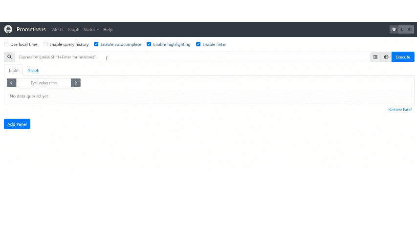

# Task on the topic Prometheus

Here we have a web application that uses a **Redis** database.
The configuration details for the connection between the application and the database can be found in the application.
The task is to containerize the application and the database and provide container monitoring using **Prometheus**.
Please write a `Dockerfile` and configure the `docker-compose.yml` file.
The services should be described as follows in the `docker-compose.yml` file:
- the service named `webapp` should run the application container
- the service named `redis` should run the **Redis** database container
- the service named `prometheus` should run the **Prometheus** container

 Please make sure to include additional services if needed. When we run the command `docker compose up`,
 it should start the containers with the following functionality:
 - the web application that accessible on port `8080`:
 
 - **Prometheus** that accessible on port `9090`, for example, when we request the metric `container_cpu_usage_seconds_total` in **Prometheus**, it should provide information on the amount of CPU resources utilized by containers over time:
 
